# Kafka

### Overview Diagram of Kafka

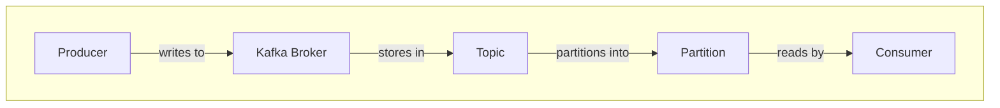

### Legend:

| Component | Explanation |
|-----------|-------------|
| **Producer** | Sends data to the Kafka Broker. |
| **Kafka Broker** | Stores data in Topics. |
| **Topic** | Contains Partitions, which are small segments of data. |
| **Partition** | The unit of data storage where Consumers read data. |
| **Consumer** | Reads data from Partitions. |

### Detailed Diagram of Producer with Spring Cloud Stream

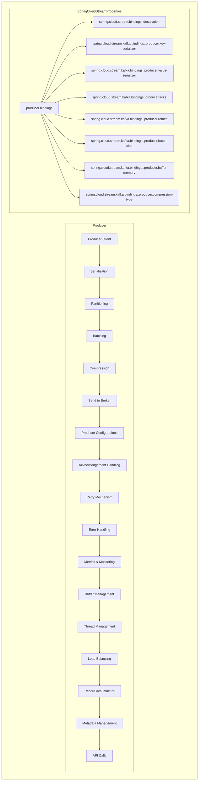

### Legend:

| Property | Example Value | Reason for Choice | Other Possible Values | Default Value | Explanation |
|----------|---------------|-------------------|-----------------------|---------------|-------------|
| **Producer Client** | `spring.kafka.producer.client-id=my-producer` | Set ID for the producer for easy tracking and management. | Any descriptive string. | (empty) | Producer ID for identification. |
| **Serialization** | `spring.kafka.producer.key-serializer=org.apache.kafka.common.serialization.StringSerializer`<br>`spring.kafka.producer.value-serializer=org.apache.kafka.common.serialization.StringSerializer` | Use StringSerializer for string data. | `org.apache.kafka.common.serialization.ByteArraySerializer`, `org.apache.kafka.common.serialization.LongSerializer` | `org.apache.kafka.common.serialization.StringSerializer` | Convert data to byte format for sending. |
| **Partitioning** | `spring.cloud.stream.kafka.bindings.output.producer.partitionKeyExpression=payload.id` | Use the `id` field in the payload to determine partition, helping to distribute data evenly. | Any SpEL expression pointing to a specific field in the payload. | (empty) | Determine which partition the data will be stored in. |
| **Batching** | `spring.kafka.producer.batch-size=16384` | Default batch size is 16KB, improving performance. | Any integer representing the byte size (e.g., 32768 for 32KB). | 16384 | Group messages before sending. |
| **Compression** | `spring.kafka.producer.compression-type=gzip` | Use gzip to compress data, reducing transfer size. | `none`, `snappy`, `lz4`, `zstd` | `none` | Compress data to reduce size. |
| **Producer Configurations** | `spring.kafka.producer.acks=all` | Wait for all replicas to receive data before acknowledging, ensuring data consistency. | `0` (no acknowledgment), `1` (only leader acknowledgment) | `1` | Acknowledgment from broker when data is successfully sent. |
| **Retry Mechanism** | `spring.kafka.producer.retries=3` | Retry 3 times if sending fails, ensuring data is successfully sent. | Any integer representing the number of retries. | `0` | Retry mechanism when sending fails. |
| **Buffer Management** | `spring.kafka.producer.buffer-memory=33554432` | Set buffer memory to 32MB, ensuring enough memory to store data before sending. | Any integer representing the byte size (e.g., 67108864 for 64MB). | 33554432 | Manage the producer buffer. |
| **Destination** | `spring.cloud.stream.bindings.output.destination=my-topic` | Send data to the `my-topic` topic. | Any valid topic name. | (empty) | Destination topic name to send data to. |
| **Key Serializer** | `spring.cloud.stream.kafka.bindings.output.producer.key-serializer=org.apache.kafka.common.serialization.StringSerializer` | Use StringSerializer for string keys. | `org.apache.kafka.common.serialization.ByteArraySerializer`, `org.apache.kafka.common.serialization.LongSerializer` | `org.apache.kafka.common.serialization.StringSerializer` | Serialization format for the key. |
| **Value Serializer** | `spring.cloud.stream.kafka.bindings.output.producer.value-serializer=org.apache.kafka.common.serialization.StringSerializer` | Use StringSerializer for string values. | `org.apache.kafka.common.serialization.ByteArraySerializer`, `org.apache.kafka.common.serialization.LongSerializer` | `org.apache.kafka.common.serialization.StringSerializer` | Serialization format for the value. |
| **Acks** | `spring.cloud.stream.kafka.bindings.output.producer.acks=all` | Wait for all replicas to receive data before acknowledging, ensuring data consistency. | `0` (no acknowledgment), `1` (only leader acknowledgment) | `1` | Acknowledgment from broker when data is successfully sent. |
| **Retries** | `spring.cloud.stream.kafka.bindings.output.producer.retries=3` | Retry 3 times if sending fails, ensuring data is successfully sent. | Any integer representing the number of retries. | `0` | Number of retries when sending fails. |
| **Batch Size** | `spring.cloud.stream.kafka.bindings.output.producer.batch-size=16384` | Set batch size to 16KB, improving performance. | Any integer representing the byte size. | 16384 | Batch size. |
| **Buffer Memory** | `spring.cloud.stream.kafka.bindings.output.producer.buffer-memory=33554432` | Set buffer memory to 32MB, ensuring enough memory to store data before sending. | Any integer representing the byte size. | 33554432 | Producer buffer memory. |
| **Compression Type** | `spring.cloud.stream.kafka.bindings.output.producer.compression-type=gzip` | Use gzip to compress data, reducing transfer size. | `none`, `snappy`, `lz4`, `zstd` | `none` | Data compression type. |

### Detailed Diagram of Broker with Spring Cloud Stream

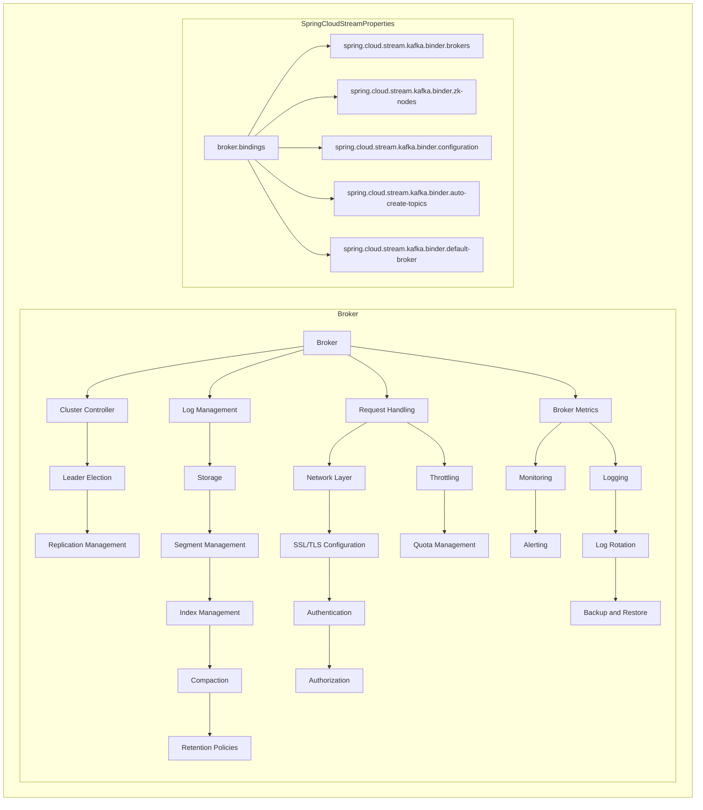

### Legend:

| Property | Example Value | Reason for Choice | Other Possible Values | Default Value | Explanation |
|----------|---------------|-------------------|-----------------------|---------------|-------------|
| **Broker Bindings** | `spring.cloud.stream.kafka.binder.brokers=kafka1:9092,kafka2:9092` | Set list of brokers for connection configuration. | Any valid list of broker addresses. | `localhost:9092` | List of broker addresses to connect to. |
| **Zookeeper Nodes** | `spring.cloud.stream.kafka.binder.zk-nodes=zookeeper1:2181,zookeeper2:2181` | Set list of Zookeeper nodes for managing Kafka cluster. | Any valid list of Zookeeper node addresses. | `localhost:2181` | List of Zookeeper node addresses to connect to. |
| **Configuration** | `spring.cloud.stream.kafka.binder.configuration.replication.factor=3` | Set replication factor to ensure data availability. | Any integer representing the replication factor. | (empty) | Replication factor configuration for the broker. |
| **Auto Create Topics** | `spring.cloud.stream.kafka.binder.auto-create-topics=true` | Enable auto-creation of topics for easy management. | `false` if auto-creation of topics is not desired. | `true` | Automatically create topics if they do not exist. |
| **Default Broker** | `spring.cloud.stream.kafka.binder.default-broker=kafka1:9092` | Set default broker for easy configuration. | Any valid broker address. | `localhost:9092` | Default broker address to connect to. |

### Detailed Diagram of Topic with Spring Cloud Stream

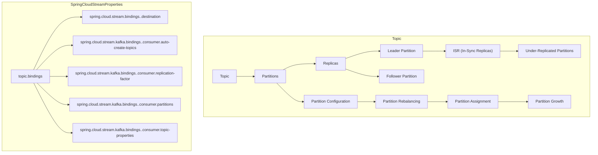

### Legend:

| Property | Example Value | Reason for Choice | Other Possible Values | Default Value | Explanation |
|----------|---------------|-------------------|-----------------------|---------------|-------------|
| **Destination** | `spring.cloud.stream.bindings.input.destination=my-topic` | Set the destination channel to `my-topic` to send data to a specific topic. | Any valid topic name. | (empty) | Destination topic name to receive data from. |
| **Partitions** | `spring.cloud.stream.kafka.bindings.input.consumer.partitions=3` | Set the number of partitions to 3 for better load distribution. | Any integer representing the number of partitions. | `1` | Number of partitions for the topic. |
| **Replication Factor** | `spring.cloud.stream.kafka.bindings.input.consumer.replication-factor=2` | Set replication factor to 2 to ensure data availability. | Any integer representing the replication factor. | `1` | Number of replicas for each partition. |
| **Auto Create Topics** | `spring.cloud.stream.kafka.bindings.input.consumer.auto-create-topics=true` | Enable auto-creation of topics for easy management. | `false` if auto-creation of topics is not desired. | `true` | Automatically create topics if they do not exist. |
| **Topic Properties** | `spring.cloud.stream.kafka.bindings.input.consumer.topic-properties=cleanup.policy=compact` | Set the cleanup.policy property of the topic to compact for efficient data storage. | Any valid topic property. | (empty) | Configuration properties for the topic. |

### Detailed Diagram of Partition with Spring Cloud Stream

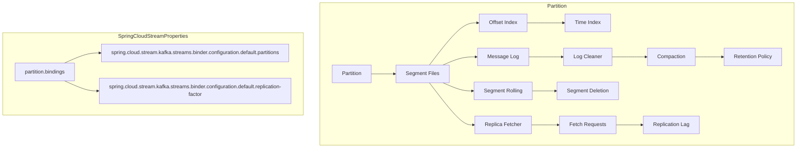

### Legend:

| Property | Example Value | Reason for Choice | Other Possible Values | Default Value | Explanation |
|----------|---------------|-------------------|-----------------------|---------------|-------------|
| **Default Partitions** | `spring.cloud.stream.kafka.streams.binder.configuration.default.partitions=3` | Set default number of partitions to 3 for better load distribution. | Any integer representing the number of partitions. | `1` | Default number of partitions for topics. |
| **Default Replication Factor** | `spring.cloud.stream.kafka.streams.binder.configuration.default.replication-factor=2` | Set default replication factor to 2 to ensure data availability. | Any integer representing the replication factor. | `1` | Default number of replicas for each partition. |

### Detailed Diagram of Consumer with Spring Cloud Stream

```mermaid
graph TD
    subgraph " "
        A[Consumer Client] --> B[Deserialization]
        B --> C[Partition Assignment]
        C --> D[Offset Management]
        D --> E[Fetch Requests]
        E --> F[Message Processing]
        F --> G[Rebalancing]
        G --> H[Commit Offsets]
        H --> I[Consumer Configurations]
        I --> J[Consumer Group Management]
        J --> K[Heartbeats]
        K --> L[Session Timeouts]
        L --> M[Error Handling]
        M --> N[Retry Logic]
        N --> O[Metrics & Monitoring]
        O --> P[Logging]
        P --> Q[Rate Limiting]
        Q --> R[Backoff Strategy]
        R --> S[Thread Management]
        S --> T[Load Balancing]
        subgraph SpringCloudStreamProperties
            A1[consumer.bindings] --> B1[spring.cloud.stream.bindings.<channelName>.destination]
            A1 --> C1[spring.cloud.stream.kafka.bindings.<channelName>.consumer.group]
            A1 --> D1[spring.cloud.stream.kafka.bindings.<channelName>.consumer.key-deserializer]
            A1 --> E1[spring.cloud.stream.kafka.bindings.<channelName>.consumer.value-deserializer]
            A1 --> F1[spring.cloud.stream.kafka.bindings.<channelName>.consumer.auto-offset-reset]
            A1 --> G1[spring.cloud.stream.kafka.bindings.<channelName>.consumer.max-poll-records]
            A1 --> H1[spring.cloud.stream.kafka.bindings.<channelName>.consumer.enable-auto-commit]
        end
    end
```

### Legend:

| Property | Example Value | Reason for Choice | Other Possible Values | Default Value | Explanation |
|----------|---------------|-------------------|-----------------------|---------------|-------------|
| **Consumer Client** | `spring.kafka.consumer.client-id=my-consumer` | Set ID for the consumer for easy tracking and management. | Any descriptive string. | (empty) | Consumer ID for identification. |
| **Deserialization** | `spring.kafka.consumer.key-deserializer=org.apache.kafka.common.serialization.StringDeserializer`<br>`spring.kafka.consumer.value-deserializer=org.apache.kafka.common.serialization.StringDeserializer` | Use StringDeserializer for string data. | `org.apache.kafka.common.serialization.ByteArrayDeserializer`, `org.apache.kafka.common.serialization.LongDeserializer` | `org.apache.kafka.common.serialization.StringDeserializer` | Convert data from byte format to object. |
| **Partition Assignment** |  |  |  |  | Assign partitions to consumers. |
| **Offset Management** | `spring.kafka.consumer.auto-offset-reset=earliest` | Reset offset to the beginning if no prior offset is found, ensuring no data is missed. | `latest` (read from the latest), `none` (do not auto-reset) | `latest` | Manage the reading position of the consumer. |
| **Fetch Requests** |  |  |  |  | Request data from broker. |
| **Message Processing** |  |  |  |  | Process received messages. |
| **Rebalancing** |  |  |  |  | Rebalance partitions among consumers. |
| **Commit Offsets** | `spring.kafka.consumer.enable-auto-commit=true` | Enable auto-commit of offsets for simplified offset management. | `false` if manual offset management is desired. | `true` | Record the read position of the consumer. |
| **Consumer Configurations** |  |  |  |  | Consumer configurations. |
| **Consumer Group Management** | `spring.kafka.consumer.group-id=my-group` | Set group ID for the consumer to distinguish between different groups. | Any descriptive string. | (empty) | Manage consumer groups. |
| **Heartbeats** |  |  |  |  | Keep-alive signals between consumer and broker. |
| **Session Timeouts** |  |  |  |  | Session timeout settings. |
| **Error Handling** |  |  |  |  | Handle errors when reading data. |
| **Retry Logic** |  |  |  |  | Retry mechanism when reading fails. |
| **Metrics & Monitoring** |  |  |  |  | Monitor and collect metrics. |
| **Logging** |  |  |  |  | Record consumer activities. |
| **Rate Limiting** |  |  |  |  | Limit the rate of data reading. |
| **Backoff Strategy** |  |  |  |  | Backoff strategy when encountering errors. |
| **Thread Management** |  |  |  |  | Manage processing threads. |
| **Load Balancing** |  |  |  |  | Balance load when reading data. |
| **Destination** | `spring.cloud.stream.bindings.input.destination=my-topic` | Set the destination channel to `my-topic` to receive data from a specific topic. | Any valid topic name. | (empty) | Destination topic name to receive data from. |
| **Group** | `spring.cloud.stream.kafka.bindings.input.consumer.group=my-group` | Set group ID for the consumer to distinguish between different groups. | Any descriptive string. | (empty) | Consumer group. |
| **Key Deserializer** | `spring.cloud.stream.kafka.bindings.input.consumer.key-deserializer=org.apache.kafka.common.serialization.StringDeserializer` | Use StringDeserializer for string keys. | `org.apache.kafka.common.serialization.ByteArrayDeserializer`, `org.apache.kafka.common.serialization.LongDeserializer` | `org.apache.kafka.common.serialization.StringDeserializer` | Deserialization format for the key. |
| **Value Deserializer** | `spring.cloud.stream.kafka.bindings.input.consumer.value-deserializer=org.apache.kafka.common.serialization.StringDeserializer` | Use StringDeserializer for string values. | `org.apache.kafka.common.serialization.ByteArrayDeserializer`, `org.apache.kafka.common.serialization.LongDeserializer` | `org.apache.kafka.common.serialization.StringDeserializer` | Deserialization format for the value. |
| **Auto Offset Reset** | `spring.cloud.stream.kafka.bindings.input.consumer.auto-offset-reset=earliest` | Reset offset to the beginning if no prior offset is found, ensuring no data is missed. | `latest` (read from the latest), `none` (do not auto-reset) | `latest` | Auto-reset offset setting. |
| **Max Poll Records** | `spring.cloud.stream.kafka.bindings.input.consumer.max-poll-records=500` | Set the maximum number of records to 500 for optimized reading performance. | Any integer representing the number of records. | 500 | Maximum number of records per poll. |
| **Enable Auto Commit** | `spring.cloud.stream.kafka.bindings.input.consumer.enable-auto-commit=true` | Enable auto-commit of offsets for simplified offset management. | `false` if manual offset management is desired. | `true` | Enable/disable auto-commit of offsets. |

# Usercases

### 1. Real-time Data Processing and Analytics

**Scenario:**
A financial services company needs to process and analyze large volumes of transaction data in real-time to detect fraudulent activities.

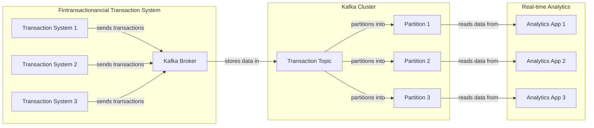

#### Legend

| Component                         | Explanation                                                 |
|-----------------------------------|-------------------------------------------------------------|
| **Transaction System 1, 2, 3**    | Systems sending financial transaction data to Kafka.        |
| **Kafka Broker**                  | Receives and stores transaction data in a topic.            |
| **Transaction Topic**             | Contains the financial transaction data, divided into partitions. |
| **Partition 1, 2, 3**             | Sub-divisions of the topic data, enabling parallel processing.|
| **Analytics App 1, 2, 3**         | Applications processing the transaction data for fraud detection. |

### 2. Log Aggregation and Monitoring

**Scenario:**
An IT organization needs to aggregate logs from various applications, servers, and devices to monitor the health and performance of its infrastructure in real-time.

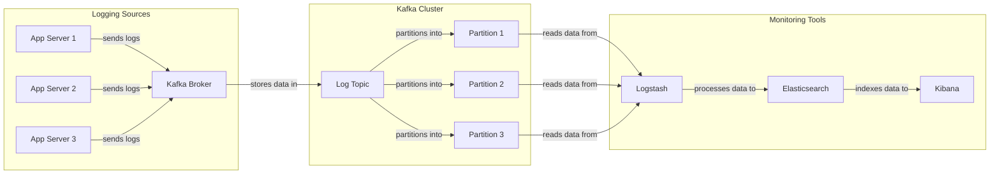

#### Legend

| Component               | Explanation                                         |
|-------------------------|-----------------------------------------------------|
| **App Server 1, 2, 3**  | Servers sending log data to Kafka.                  |
| **Kafka Broker**        | Receives and stores log data in a topic.            |
| **Log Topic**           | Contains the log data, divided into partitions.     |
| **Partition 1, 2, 3**   | Sub-divisions of the topic data, enabling parallel processing.|
| **Logstash**            | Reads log data from Kafka, processes it, and sends it to Elasticsearch. |
| **Elasticsearch**       | Indexes and stores processed log data for querying. |
| **Kibana**              | Visualizes log data from Elasticsearch for monitoring. |

### 3. Event-Driven Microservices Architecture

**Scenario:**
A retail company needs to build an event-driven microservices architecture to handle various events such as customer orders, inventory updates, and shipping notifications in a decoupled and scalable manner.

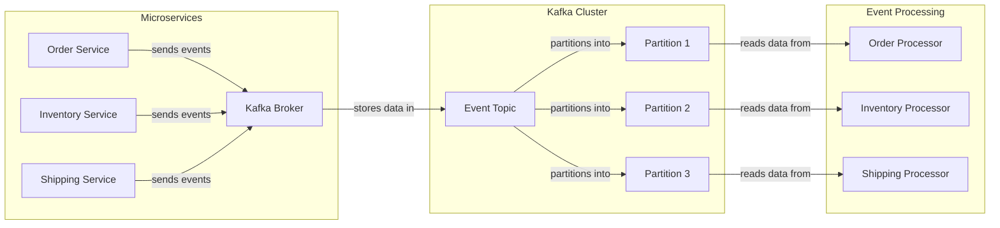

#### Legend

| Component                        | Explanation                                                 |
|----------------------------------|-------------------------------------------------------------|
| **Order Service**                | Microservice sending order events to Kafka.                 |
| **Inventory Service**            | Microservice sending inventory events to Kafka.             |
| **Shipping Service**             | Microservice sending shipping events to Kafka.              |
| **Kafka Broker**                 | Receives and stores event data in a topic.                  |
| **Event Topic**                  | Contains the event data, divided into partitions.           |
| **Partition 1, 2, 3**            | Sub-divisions of the topic data, enabling parallel processing.|
| **Order Processor**              | Microservice processing order events.                       |
| **Inventory Processor**          | Microservice processing inventory events.                   |
| **Shipping Processor**           | Microservice processing shipping events.                    |

### 4. Stream Processing for IoT Devices

**Scenario:**
A smart home company needs to collect and process data from millions of IoT devices in real-time to monitor and control home appliances, ensuring optimal performance and energy efficiency.

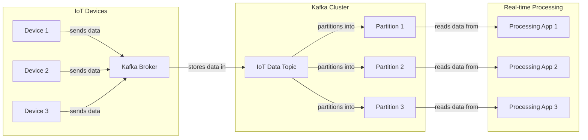

#### Legend

| Component            | Explanation                                         |
|----------------------|-----------------------------------------------------|
| **Device 1, 2, 3**   | IoT devices sending data to Kafka.                  |
| **Kafka Broker**     | Receives and stores IoT data in a topic.            |
| **IoT Data Topic**   | Contains the IoT data, divided into partitions.     |
| **Partition 1, 2, 3**| Sub-divisions of the topic data, enabling parallel processing.|
| **Processing App 1, 2, 3** | Applications processing the IoT data for real-time control and monitoring. |

### 5. Real-time ETL (Extract, Transform, Load)

**Scenario:**
A data analytics company needs to perform real-time ETL on data collected from multiple sources such as databases, APIs, and logs, and then load the transformed data into a data warehouse for analysis.

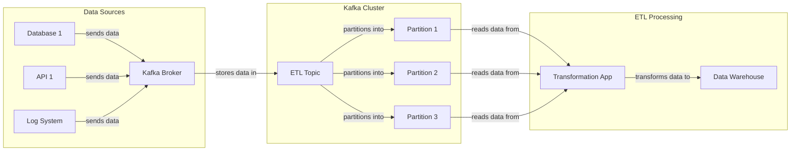

#### Legend

| Component                   | Explanation                                         |
|-----------------------------|-----------------------------------------------------|
| **Database 1**              | Database sending data to Kafka.                     |
| **API 1**                   | API sending data to Kafka.                          |
| **Log System**              | Log system sending data to Kafka.                   |
| **Kafka Broker**            | Receives and stores data in a topic.                |
| **ETL Topic**               | Contains the ETL data, divided into partitions.     |
| **Partition 1, 2, 3**       | Sub-divisions of the topic data, enabling parallel processing.|
| **Transformation App**      | Application transforming the data.                  |
| **Data Warehouse**          | Stores transformed data for analysis.               |

### 6. User Activity Tracking

**Scenario:**
An e-commerce company needs to track user activity on its website and mobile app in real-time to understand customer behavior, improve user experience, and target advertisements effectively.

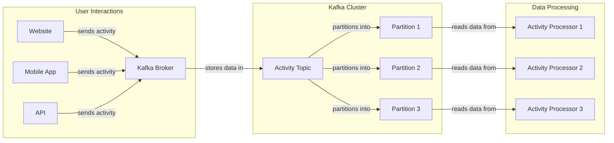

#### Legend

| Component                     | Explanation                                         |
|-------------------------------|-----------------------------------------------------|
| **Website**                   | Sends user activity data to Kafka.                  |
| **Mobile App**                | Sends user activity data to Kafka.                  |
| **API**                       | Sends user activity data to Kafka.                  |
| **Kafka Broker**              | Receives and stores user activity data in a topic.  |
| **Activity Topic**            | Contains the user activity data, divided into partitions.|
| **Partition 1, 2, 3**         | Sub-divisions of the topic data, enabling parallel processing.|
| **Activity Processor 1, 2, 3**| Applications processing user activity data for analytics and personalization. |

### 7. Data Integration Across Multiple Systems

**Scenario:**
A large enterprise needs to integrate data from various systems such as CRM, ERP, and HR systems to create a unified view of business operations and enable seamless data sharing across departments.

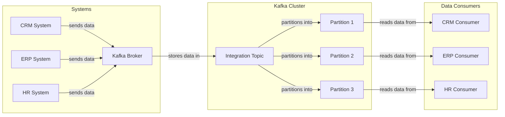

#### Legend

| Component            | Explanation                                         |
|----------------------|-----------------------------------------------------|
| **CRM System**       | Sends CRM data to Kafka.                            |
| **ERP System**       | Sends ERP data to Kafka.                            |
| **HR System**        | Sends HR data to Kafka.                             |
| **Kafka Broker**     | Receives and stores data in a topic.                |
| **Integration Topic**| Contains the integrated data, divided into partitions.|
| **Partition 1, 2, 3**| Sub-divisions of the topic data, enabling parallel processing.|
| **CRM Consumer**     | Application consuming and processing CRM data.      |
| **ERP Consumer**     | Application consuming and processing ERP data.      |
| **HR Consumer**      | Application consuming and processing HR data.       |

### 8. Messaging Backbone for Mobile Applications

**Scenario:**
A social media company needs a robust messaging system to handle real-time chat and notifications for millions of users, ensuring low latency and high availability.

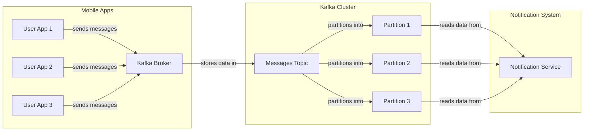

#### Legend

| Component                   | Explanation                                         |
|-----------------------------|-----------------------------------------------------|
| **User App 1, 2, 3**        | Mobile applications sending messages to Kafka.      |
| **Kafka Broker**            | Receives and stores messages in a topic.            |
| **Messages Topic**          | Contains the messages, divided into partitions.     |
| **Partition 1, 2, 3**       | Sub-divisions of the topic data, enabling parallel processing.|
| **Notification Service**    | Service processing and delivering notifications based on the messages. |

### 9. Monitoring and Alerting for DevOps

**Scenario:**
A software development company needs to collect and process metrics and logs from its CI/CD pipelines, servers, and applications to monitor performance, detect issues, and alert DevOps teams in real-time.

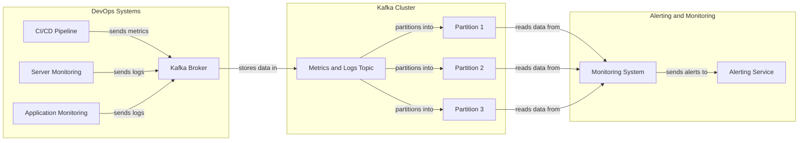

#### Legend

| Component                        | Explanation                                         |
|----------------------------------|-----------------------------------------------------|
| **CI/CD Pipeline**               | Sends metrics to Kafka.                             |
| **Server Monitoring**            | Sends server logs to Kafka.                         |
| **Application Monitoring**       | Sends application logs to Kafka.                    |
| **Kafka Broker**                 | Receives and stores metrics and logs in a topic.    |
| **Metrics and Logs Topic**       | Contains the metrics and logs, divided into partitions.|
| **Partition 1, 2, 3**            | Sub-divisions of the topic data, enabling parallel processing.|
| **Monitoring System**            | System processing and analyzing metrics and logs.   |
| **Alerting Service**             | Service sending alerts based on monitoring results. |

### 10. Data Replication and Backup

**Scenario:**
A cloud storage provider needs to replicate data across multiple data centers in real-time to ensure data availability, disaster recovery, and fault tolerance.

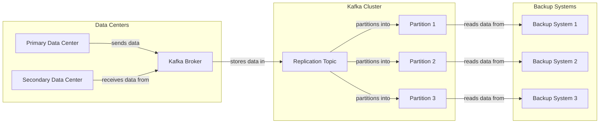

#### Legend

| Component                        | Explanation                                         |
|----------------------------------|-----------------------------------------------------|
| **Primary Data Center**          | Sends data to Kafka for replication.                |
| **Secondary Data Center**        | Receives replicated data from Kafka.                |
| **Kafka Broker**                 | Receives and stores data in a topic.                |
| **Replication Topic**            | Contains the replicated data, divided into partitions.|
| **Partition 1, 2, 3**            | Sub-divisions of the topic data, enabling parallel processing.|
| **Backup System 1, 2, 3**        | Systems reading data from Kafka for backup purposes.|

# Comparing

### Comparison of Broker Technologies

| Feature                  | Apache Kafka                  | RabbitMQ                       | ActiveMQ                       | Amazon Kinesis                | Google Pub/Sub                 | Azure Event Hub                |
|--------------------------|-------------------------------|--------------------------------|--------------------------------|--------------------------------|---------------------------------|--------------------------------|
| **Type**                 | Distributed Log               | Message Broker                 | Message Broker                 | Data Stream                    | Message Broker                  | Event Ingestion and Stream     |
| **Use Case**             | Real-time data streaming      | Messaging between applications | Messaging between applications | Real-time data streaming       | Messaging between applications  | Real-time event ingestion and streaming |
| **Message Durability**   | High (configurable retention) | High (with persistent queues)  | High (with persistent queues)  | High                           | High                            | High                           |
| **Message Ordering**     | Yes (within partitions)       | Yes (FIFO queues)              | Yes (FIFO queues)              | Yes (per shard)                | Yes (per topic/partition)       | Yes (within partitions)       |
| **Scalability**          | High (horizontal scaling)     | Moderate                       | Moderate                       | High (horizontal scaling)      | High (horizontal scaling)       | High (horizontal scaling)      |
| **Fault Tolerance**      | High (replication)            | Moderate (clustering)          | Moderate (clustering)          | High (replication)             | High (replication)              | High (replication)             |
| **Latency**              | Low                           | Moderate                       | Moderate                       | Low                            | Moderate                        | Low                            |
| **Throughput**           | High                          | Moderate                       | Moderate                       | High                           | High                            | High                           |
| **Protocol Support**     | Custom (Kafka Protocol)       | AMQP, MQTT, STOMP              | AMQP, MQTT, STOMP              | Custom (Kinesis Protocol)      | HTTP/2, gRPC                    | AMQP                           |
| **Transaction Support**  | Yes                           | Yes                            | Yes                            | No                             | No                              | No                             |
| **Management Tools**     | Kafka Manager, Confluent      | RabbitMQ Management Plugin     | Hawtio, JMX                    | AWS Management Console         | Google Cloud Console            | Azure Portal, CLI, SDKs        |
| **Client Libraries**     | Java, Python, Go, C++, .NET   | Java, Python, .NET, Ruby, Go   | Java, C++, Python, .NET, Ruby  | Java, Python, .NET, Node.js    | Java, Python, Go, Node.js       | Java, Python, .NET, Node.js    |
| **License**              | Apache 2.0                    | Mozilla Public License         | Apache 2.0                     | Proprietary (AWS)              | Proprietary (Google)            | Proprietary (Microsoft)        |
| **Hosting Options**      | On-premises, Cloud            | On-premises, Cloud             | On-premises, Cloud             | AWS                            | Google Cloud                    | Azure                          |
| **Rating (1-5)**         | 5                             | 4                              | 3.5                            | 4.5                            | 4.5                             | 4.5                            |
| **Recommendation**       | Highly recommended for high throughput and real-time data streaming applications. | Recommended for messaging between applications and moderate workloads. | Suitable for traditional messaging with moderate scalability needs. | Ideal for AWS ecosystem users needing high scalability and real-time data streaming. | Ideal for Google Cloud users needing high scalability and reliable messaging. | Ideal for Azure ecosystem users needing high scalability and real-time event ingestion. |

### Comparison of Libraries for Kafka

| Feature                          | Spring Cloud Stream               | Confluent Kafka                   | Kafka Streams                     | Akka Streams                      | Faust (Python)                    |
|----------------------------------|-----------------------------------|-----------------------------------|-----------------------------------|-----------------------------------|-----------------------------------|
| **Language**                     | Java, Spring Framework            | Java, Python, C++, .NET           | Java                              | Scala                             | Python                             |
| **Integration**                  | Spring Boot                       | Native Kafka                      | Native Kafka                      | Akka Framework                    | Celery-like stream processing      |
| **Ease of Use**                  | High (Spring abstractions)        | High (Comprehensive client)       | Moderate (Requires Kafka knowledge) | Moderate (Actor-based model)      | High (Pythonic API)               |
| **Real-time Processing**         | Yes                               | Yes                               | Yes                               | Yes                               | Yes                               |
| **Batch Processing**             | Yes                               | Yes                               | No                                | No                                | No                                |
| **Stateful Processing**          | Yes                               | Yes                               | Yes                               | Yes                               | Yes                               |
| **Windowing Support**            | Yes                               | Yes                               | Yes                               | Yes                               | Yes                               |
| **Fault Tolerance**              | High                              | High                              | High                              | High                              | High                              |
| **Exactly-once Semantics**       | Yes                               | Yes                               | Yes                               | No                                | No                                |
| **Management Tools**             | Spring Boot Actuator, Micrometer  | Confluent Control Center          | Custom (Kafka monitoring tools)   | Custom (Akka monitoring tools)    | Custom (Faust monitoring tools)   |
| **Community Support**            | Strong (Spring community)         | Strong (Confluent community)      | Moderate                          | Moderate                          | Moderate                          |
| **Documentation**                | Extensive                         | Extensive                         | Extensive                         | Extensive                         | Good                              |
| **License**                      | Apache 2.0                        | Apache 2.0                        | Apache 2.0                        | Apache 2.0                        | Apache 2.0                        |
| **Rating (1-5)**                 | 4.5                               | 5                                 | 4.5                               | 4                                 | 4                                 |
| **Recommendation**               | Highly recommended for Java and Spring Boot applications requiring Kafka integration. | Highly recommended for diverse programming environments with robust Kafka support. | Ideal for native Kafka stream processing with stateful capabilities. | Suitable for stream processing within Akka-based applications. | Recommended for Python developers needing real-time stream processing. |

### Summary

- **Apache Kafka**: **Rating: 5** - Highly recommended for high throughput and real-time data streaming applications.
- **RabbitMQ**: **Rating: 4** - Recommended for messaging between applications and moderate workloads.
- **ActiveMQ**: **Rating: 3.5** - Suitable for traditional messaging with moderate scalability needs.
- **Amazon Kinesis**: **Rating: 4.5** - Ideal for AWS ecosystem users needing high scalability and real-time data streaming.
- **Google Pub/Sub**: **Rating: 4.5** - Ideal for Google Cloud users needing high scalability and reliable messaging.
- **Azure Event Hub**: **Rating: 4.5** - Ideal for Azure ecosystem users needing high scalability and real-time event ingestion.

- **Spring Cloud Stream**: **Rating: 4.5** - Highly recommended for Java and Spring Boot applications requiring Kafka integration.
- **Confluent Kafka**: **Rating: 5** - Highly recommended for diverse programming environments with robust Kafka support.
- **Kafka Streams**: **Rating: 4.5** - Ideal for native Kafka stream processing with stateful capabilities.
- **Akka Streams**: **Rating: 4** - Suitable for stream processing within Akka-based applications.
- **Faust**: **Rating: 4** - Recommended for Python developers needing real-time stream processing.

# Simple Spring Cloud Stream with kafka

```
<project xmlns="http://maven.apache.org/POM/4.0.0"
         xmlns:xsi="http://www.w3.org/2001/XMLSchema-instance"
         xsi:schemaLocation="http://maven.apache.org/POM/4.0.0 https://maven.apache.org/xsd/maven-4.0.0.xsd">
    <modelVersion>4.0.0</modelVersion>

    <parent>
        <groupId>org.springframework.boot</groupId>
        <artifactId>spring-boot-starter-parent</artifactId>
        <version>3.3.2</version>
        <relativePath/> <!-- lookup parent from repository -->
    </parent>

    <groupId>vn.core</groupId>
    <artifactId>booking</artifactId>
    <version>0.0.1-SNAPSHOT</version>
    <name>booking</name>
    <description>Core booking</description>

    <properties>
        <java.version>21</java.version>
        <spring-cloud.version>2023.0.3</spring-cloud.version>
    </properties>

    <dependencies>
        <!-- Spring Boot Dependencies -->
        <dependency>
            <groupId>org.springframework.boot</groupId>
            <artifactId>spring-boot-starter-web</artifactId>
        </dependency>

        <!-- Spring Cloud Stream Dependencies -->
        <dependency>
            <groupId>org.springframework.cloud</groupId>
            <artifactId>spring-cloud-stream</artifactId>
        </dependency>
        <dependency>
            <groupId>org.springframework.cloud</groupId>
            <artifactId>spring-cloud-stream-binder-kafka</artifactId>
        </dependency>

        <!-- Testing Dependencies -->
        <dependency>
            <groupId>org.springframework.boot</groupId>
            <artifactId>spring-boot-starter-test</artifactId>
            <scope>test</scope>
        </dependency>
        <dependency>
            <groupId>org.springframework.cloud</groupId>
            <artifactId>spring-cloud-stream-test-binder</artifactId>
            <scope>test</scope>
        </dependency>
    </dependencies>

    <dependencyManagement>
        <dependencies>
            <dependency>
                <groupId>org.springframework.cloud</groupId>
                <artifactId>spring-cloud-dependencies</artifactId>
                <version>${spring-cloud.version}</version>
                <type>pom</type>
                <scope>import</scope>
            </dependency>
        </dependencies>
    </dependencyManagement>

    <build>
        <plugins>
            <plugin>
                <groupId>org.springframework.boot</groupId>
                <artifactId>spring-boot-maven-plugin</artifactId>
            </plugin>
        </plugins>
    </build>

</project>

```

```
spring:
  cloud:
    stream:
      bindings:
        booking-out-0:
          destination: my-topic
          content-type: application/json
        booking-in-0:
          destination: my-topic
          group: my-group
          content-type: application/json
      kafka:
        binder:
          brokers: localhost:9092

```

``` 
    import org.springframework.beans.factory.annotation.Autowired;
    import org.springframework.web.bind.annotation.PostMapping;
    import org.springframework.web.bind.annotation.RequestBody;
    import org.springframework.web.bind.annotation.RequestMapping;
    import org.springframework.web.bind.annotation.RestController;

    @RestController
    @RequestMapping("/api/bookings")
    public class BookingController {

        @Autowired
        private BookingProducer bookingProducer;

        @PostMapping("/send")
        public String sendMessage(@RequestBody String message) {
            bookingProducer.sendMessage("booking-out-0", message);
            return "Message sent: " + message;
        }
    }

```

```
    import org.springframework.beans.factory.annotation.Autowired;
    import org.springframework.cloud.stream.function.StreamBridge;
    import org.springframework.stereotype.Component;

    @Component
    public class BookingProducer {

        @Autowired
        private StreamBridge streamBridge;

        public void sendMessage(String topic, String message) {
            streamBridge.send(topic, message);
        }
    }

```

```
    import java.util.function.Consumer;

    import org.springframework.context.annotation.Bean;
    import org.springframework.stereotype.Component;

    @Component
    public class BookingConsumer {

        @Bean
        public Consumer<String> booking() {
            return message -> {
                System.out.println("Received: " + message);
            };
        }
    }
```

```
version: '3.8'

services:
  zookeeper:
    image: confluentinc/cp-zookeeper:7.2.1
    container_name: zookeeper
    ports:
      - "2181:2181"
    environment:
      ZOOKEEPER_CLIENT_PORT: 2181
      ZOOKEEPER_TICK_TIME: 2000

  kafka:
    image: confluentinc/cp-kafka:7.2.1
    container_name: kafka
    ports:
      - "9092:9092"
    depends_on:
      - zookeeper
    environment:
      KAFKA_BROKER_ID: 1
      KAFKA_ZOOKEEPER_CONNECT: zookeeper:2181
      KAFKA_ADVERTISED_LISTENERS: PLAINTEXT://localhost:9092
      KAFKA_OFFSETS_TOPIC_REPLICATION_FACTOR: 1
      KAFKA_TRANSACTION_STATE_LOG_REPLICATION_FACTOR: 1
      KAFKA_TRANSACTION_STATE_LOG_MIN_ISR: 1
      KAFKA_LOG_FLUSH_INTERVAL_MESSAGES: 10000
      KAFKA_GROUP_INITIAL_REBALANCE_DELAY_MS: 0

  # kafka-ui:
  #   image: provectuslabs/kafka-ui:latest
  #   container_name: kafka-ui
  #   ports:
  #     - "8080:8080"
  #   environment:
  #     KAFKA_CLUSTERS_0_NAME: local
  #     KAFKA_CLUSTERS_0_BOOTSTRAPSERVERS: kafka:9092
  #   depends_on:
  #     - kafka

# networks:
#   default:
#     name: kafka-network

```